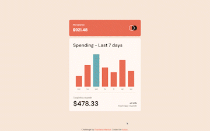
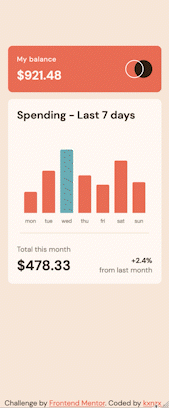

# Frontend Mentor - Expenses Chart Component Solution

This is a solution to the [Expenses Chart Component challenge on Frontend Mentor](https://www.frontendmentor.io/challenges/expenses-chart-component-e7yJBUdjwt). Frontend Mentor challenges help you improve your coding skills by building realistic projects.

## Table of contents

- [Overview](#overview)
  - [The challenge](#the-challenge)
  - [Screenshot](#screenshot)
  - [Links](#links)
- [My process](#my-process)
  - [Built with](#built-with)
  - [What I learned](#what-i-learned)
  - [Useful resources](#useful-resources)
- [Author](#author)

## Overview

### The challenge

Users should be able to:

- View the bar chart and hover over the individual bars to see the correct amounts for each day
- See the current day’s bar highlighted in a different colour to the other bars
- View the optimal layout for the content depending on their device’s screen size
- See hover states for all interactive elements on the page
- **Bonus**: Use the JSON data file provided to dynamically size the bars on the chart

### Screenshot

#### Screensize 1440px - Desktop



#### Screensize 375px - Mobile



### Links

- Solution URL: [Add solution URL here](https://your-solution-url.com)
- Live Site URL: [Add live site URL here](https://your-live-site-url.com)

## My process

- HTML semantics
- Importing Google Fonts
- Set variables
- Reset default settings
- Styles (Mobile First)
- Media Queries
- JavaScript

### Built with

- JavaScript
- Semantic HTML5 markup
- SASS custom properties
- CSS Grid
- CSS Flexbox
- Mobile-first workflow
- Google Fonts - For Fonts

### What I learned

Working on this solution was a great way for me to learn more about JavaScript. I created the vertical bar graph with Chart.js and customized the chart in JavaScript. I placed the chart in a canvas tag in HTML:

```html
<!-- Transparent element for the Vertical Bar Chart -->
<canvas id="chart" width="300" height="200"> </canvas>
```

I also learned a bit about Data Types:

- Strings: "Hello World" "Total:" "A"
- Numbers: 10 1.5 -30 1.2e10
- Boolean: true false
- null: null
  These are combinations of the above:
- Arrays [1,2,3] ["Hello","World"]
- Objects { "key":"value" } { "age": 30 }

### Useful resources

- [Chart.js](https://www.chartjs.org/docs/latest/getting-started/) - This library gave me the template to make the vertical bar graph.

## Author

- Frontend Mentor - [@kxnzx](https://www.frontendmentor.io/profile/kxnzx)
